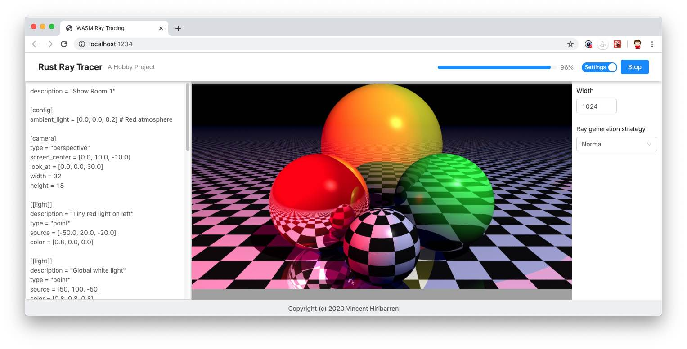

# Raytracer in Rust


Hobby project to test the Rust programming language and understand how a Ray Tracer works.

Used technologies: Rust, SDL2, TOML, WebAssembly, Parcel.js, React, Antd.


- [How to start](#how-to-start)
- [Web Browser](#web-browser)
- [Features](#features)
- [Scene Description Language](#scene-description-language)
- [To Do](#to-do)
- [References](#references)
- [License](#license)


Development can be very erratic since it is a hobby project, however if you like how
the current result is, feel free to contribute!


## How to start

Tested under MacOS 10.14.6 with Rust 1.40.0.

    $ cargo run -- samples/show_room_1.toml

Default compilation option make the rendering process quite slow, you may also test the result using:

    $ cargo run --release -- samples/show_room_1.toml

The `raytracing` directory contains the main engine, as a Rust library.<br>
The `app` directory is for a standalone app using the library.<br>
The `samples` directory has some scene description file examples that can be used with the standalone app.

Some options are available in the standalone app:

```
$ cargo run -- --help

USAGE:
    app [FLAGS] [OPTIONS] <INPUT_FILE>

FLAGS:
        --help              Prints help information
        --no-gui            Do not display the result of the rendering.
        --no-parallel       Do not use multithreading for parallel computation (slower).
        --no-progressive    Do not render in realtime in the window if GUI is activate (quicker).
        --no-status         Do not display textual progressive bar (quicker).
    -V, --version           Prints version information
    -v, --verbose           Verbosity of log messages (one for Debug level, two for Trace level)

OPTIONS:
    -h, --height <height>                Canvas height.
        --strategy-random <RAY_COUNT>    Average of RAY_COUNT random rays sent.
    -w, --width <width>                  Canvas width, default: 1024.

ARGS:
    <INPUT_FILE>    TOML file describing the scene.
```

## Web Browser

The raytracer is compatible with the WebAssembly technology. It can be launched as a web app
instead of a native app.



    $ cd webapp
    $ npm install
    $ npm start         # Start a local web server and launch a web page
    $ npm run build     # Build files in the dist/ directory
    $ npm run clean     # Remove the dist/ directory

## Features

- [X] Primitives: sphere, plane, infinite plane
- [X] Cameras: perspective, orthogonal
- [X] Light: colored light point, spot light
- [X] Textures: plain, gradient, procedural checked texture
- [X] Effects: transparency, mirror
- [X] Anti-aliasing: none, random strategy
- [X] Shadow when object obstruction
- [X] Ambiant light
- [X] Diffuse light reflexion
- [X] Specular light reflexion
- [X] Light refraction
- [X] Ray launcher recursion for transparent/mirror texture
- [X] Parallel computing
- [X] WebAssembly compatibility
- [X] TOML based scene language/configuration description

## Scene Description Language

[TOML](https://github.com/toml-lang/toml) is currently used as a format to describe a ray tracing scene.
It gives the following grammar and feeling:

```
description = "Show Room 1"

[config]
ambient_light = [0.0, 0.0, 0.2] # Red atmosphere

[camera]
type = "perspective"
screen_center = [0.0, 10.0, -10.0]
look_at = [0.0, 0.0, 30.0]
width = 32
height = 18

[[light]]
description = "Tiny red light on left"
type = "point"
source = [-50.0, 20.0, -20.0]
color = [0.8, 0.0, 0.0]

[[light]]
description = "Global white light"
type = "point"
source = [50, 100, -50]
color = [0.8, 0.8, 0.8]

[[object]]
description = "Center checked sphere"
type = "sphere"
center = [0, 0, 0]
radius = 5
texture.type = "checked"
effect.phong = {}

[[object]]
description = "Green transparent sphere on the right"
type = "sphere"
center = [10, 3, 10]
radius = 8
texture.type = "plain"
texture.color = "green"
effect.phong = {}
effect.transparency.refractive_index = 1.3

[[object]]
description = "Red mirror sphere on the left"
type = "sphere"
center = [-10, 3, 10]
radius = 8
texture.type = "plain"
texture.color = "red"
effect.phong = {}
effect.mirror.coeff = 1.0

[[object]]
description = "Yellow transparent sphere behind"
type = "sphere"
center = [0, 10, 35]
radius = 15
texture.type = "plain"
texture.color = "yellow"
effect.phong = {}
effect.transparency.refractive_index = 1.3

[[object]]
description = "Infinite plan"
type = "infinite_plan"
center = [0, -5, 0]
normal =  [0, 1, 0]
texture.type = "checked"
effect.mirror.coeff = 0.8
```

## To do

RayTracing:

- [ ] Better anti-aliasing
- [ ] Color shadow when going through transparent object
- [ ] Box primitive
- [ ] Texture image mapping
- [ ] Object transformation
- [ ] Perlin effect for bump mapping

Rust:

- [ ] More automatic tests

WebAssembly:

- [ ] Multithreading
- [ ] More automatic tests


## References

- [Le lancé de rayons](http://mathinfo.univ-reims.fr/image/siRendu/Documents/2004-Chap6-RayTracing.pdf) *(French)*
- [Moteur de Ray Tracing](https://www.cyril-rabat.fr/data/RAYTRACING_rapport.pdf) *(French)*
- [Projet module synthèse d'images](http://gregory.corgie.free.fr/dotclear/images/Raytracing/Rapport_Raytracing.pdf) *(French)*
- [Lancer de rayons](http://heigeas.free.fr/laure/ray_tracing/realisation.htm) *(French)*
- [Introduction à l'informatique graphique
](https://www.lama.univ-savoie.fr/pagesmembres/lachaud/Cours/INFO805/Tests/html/ig_tp2.html) *(French)*
- [Scratch a Pixel](https://www.scratchapixel.com/)
- [UV Mapping and Texturing](http://viclw17.github.io/2019/04/12/raytracing-uv-mapping-and-texturing/)
- [Ray Tracking: color and texture](http://www.bentonian.com/Lectures/AdvGraph1314/3.%20Ray%20tracing%20-%20color%20and%20texture.pdf)
- [Rust Lang](https://www.rust-lang.org/)

## License

MIT License

Copyright (c) 2019, 2020 Vincent Hiribarren

Permission is hereby granted, free of charge, to any person obtaining a copy
of this software and associated documentation files (the "Software"), to deal
in the Software without restriction, including without limitation the rights
to use, copy, modify, merge, publish, distribute, sublicense, and/or sell
copies of the Software, and to permit persons to whom the Software is
furnished to do so, subject to the following conditions:

The above copyright notice and this permission notice shall be included in all
copies or substantial portions of the Software.

THE SOFTWARE IS PROVIDED "AS IS", WITHOUT WARRANTY OF ANY KIND, EXPRESS OR
IMPLIED, INCLUDING BUT NOT LIMITED TO THE WARRANTIES OF MERCHANTABILITY,
FITNESS FOR A PARTICULAR PURPOSE AND NONINFRINGEMENT. IN NO EVENT SHALL THE
AUTHORS OR COPYRIGHT HOLDERS BE LIABLE FOR ANY CLAIM, DAMAGES OR OTHER
LIABILITY, WHETHER IN AN ACTION OF CONTRACT, TORT OR OTHERWISE, ARISING FROM,
OUT OF OR IN CONNECTION WITH THE SOFTWARE OR THE USE OR OTHER DEALINGS IN THE
SOFTWARE.